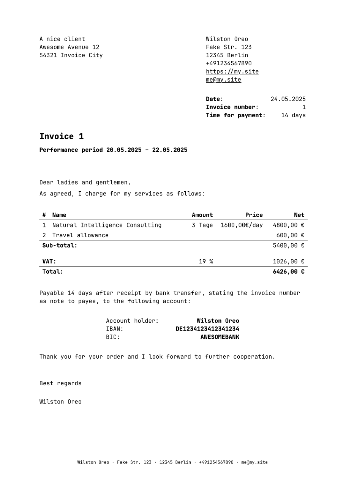

# `invoist`: Typst Invoice template

This package contains a template for writing invoices with [typst](https://typst.app).

In your console, use `typst watch example.typ` to generate an example PDF file and make live changes.

This a minimal example to create an invoice from this template:

```typ
// Translations are located in `tr.typ`.
// Currently, "de" and "en" are supported
#set text(font: "JetBrains Mono", size: 10pt, lang: "en")

// Create an invoice with VAT
#let invoice_info = (
  date: "24.05.2025",
  period: (
    begin: "20.05.2025",
    end: "22.05.2025",
  ),
  id: "1",
  due: "14 days",
  vat: 19.0,
  invoicing_party: toml("contacts.toml").me,
  recipient: toml("contacts.toml").client_a,
  positions: (
    ("Natural Intelligence Consulting", "3 Tage", "1600,00€/day", 4800.0),
    ("Travel allowance", [], [], 600.0),
  ),
)

// Create the invoice
#invoist.invoice(invoice_info)
```

The output will look similar to this:



## Disclaimer

This template doesn't constitute legal advice. Please check for yourself whether it fulfills your legal requirements!